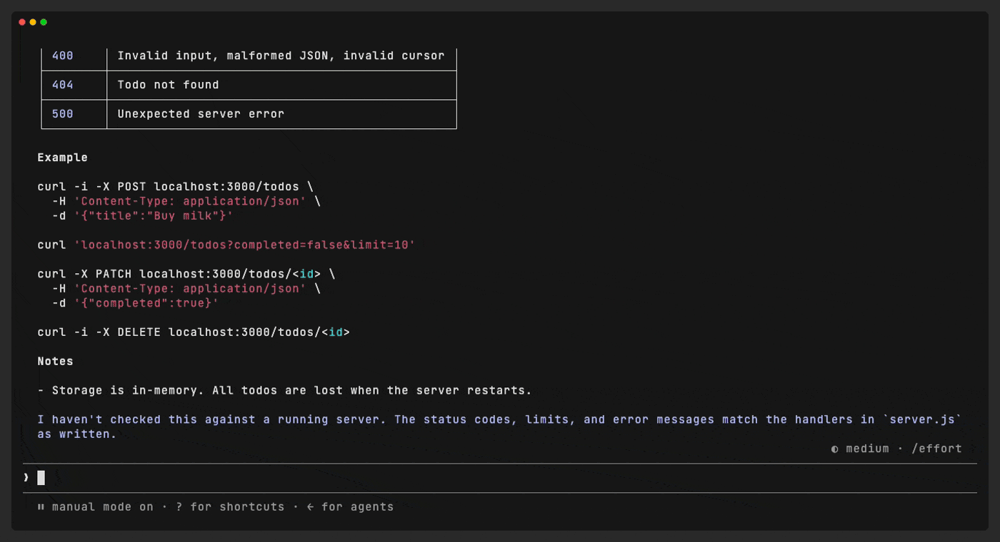

# prompt-jump

**Jump back to any prompt you typed in a Claude Code session — no more scrolling.**

[한국어](README.ko.md)

Long Claude Code sessions bury your own prompts under pages of tool output. `Ctrl+R` brings back the *text* of an old prompt, but not the *place* in the conversation where you wrote it. `prompt-jump` adds a `/jump` panel that lists every prompt of the current conversation, newest first. Pick one and the transcript scrolls straight to it.



<sub>The demo resumes a session and jumps to prompt #1 without scrolling to it first.</sub>

## Features

- **Newest first.** Every prompt of the current conversation, numbered in conversation order (`#1` is the oldest).
- **Search as you type.** Words separated by spaces must all match (case-insensitive).
- **Jump by number.** Type `12` or `#12` and press `Enter`.
- **Hop between prompts.** The panel stays open after a jump, so you can move from prompt to prompt and close it with `Esc`.
- **Works after `--resume`.** Prompts from before the restart are listed right away, even ones you have not scrolled to yet.
- **Shows only what is really there.** Prompts you rewound away, slash commands (`/rewind`, `/plugin`, …), task notifications and messages from other sessions are left out.
- **Leaves no trace.** Opening `/jump` adds nothing to the transcript or to the model's context, and it works while Claude is still responding.
- **CJK-aware.** Long Korean, Chinese and Japanese prompts are cut to the panel width without breaking the layout.
- **`Ctrl+R` is untouched.** This is an extra command, not a replacement.

## Requirements

| | |
| --- | --- |
| Claude Code | v2.1.287 or later, in the terminal (mods are an early-access feature) |
| Renderer | The fullscreen renderer (`/tui fullscreen`). Jumping scrolls Claude Code's own transcript view |
| OS | macOS or Linux. Resume support calls the system's `grep` and `find` |

## Install

From a terminal session of Claude Code:

```
/plugin install prompt-jump --marketplace nickhealthy/claude-code-prompt-jump
```

Answer `y` to add the marketplace, then choose a scope (user scope loads it in every session). The mod is active right away.

Or add the marketplace first, then install from it:

```
/plugin marketplace add nickhealthy/claude-code-prompt-jump
/plugin install prompt-jump@prompt-jump
```

<details>
<summary>Manual install (run from a local folder)</summary>

```bash
git clone https://github.com/nickhealthy/claude-code-prompt-jump.git ~/.claude/mods/prompt-jump
```

Then load it in every session through `~/.claude/settings.json`:

```json
{
  "env": {
    "CLAUDE_CODE_PLUGIN_DIRS": "/absolute/path/to/.claude/mods/prompt-jump"
  }
}
```

Or for a single session: `claude --plugin-dir ~/.claude/mods/prompt-jump`.

</details>

## Usage

| Command | What it does |
| --- | --- |
| `/jump` | Opens the panel with every prompt |
| `/jump bypass mode` | Opens it filtered to prompts that contain both words |
| `/jump 12` | Opens it showing prompt `#12` only |

Inside the panel:

| Key | Action |
| --- | --- |
| Type | Filter by words, or by number (`12`, `#12`) |
| `Enter` in the search box | Jump to the newest match |
| `Tab` / `↑` `↓` | Move between prompts |
| `Enter` / click | Jump to the selected prompt |
| `Esc` | Close the panel |

## How it works

`prompt-jump` is a [Claude Code mod](https://code.claude.com/docs/en/plugins/mods/overview): a plugin of function hooks that runs inside Claude Code.

1. **Which prompts exist.** The current conversation comes from `$.session.messages()`. Rewound branches are not part of it, so prompts you rewound away disappear, and the order is the real conversation order.
2. **Where each prompt is.** Jumping needs the id of the prompt's transcript row. Ids come from two places:
   - rows drawn on screen (a `ui.render` hook on `UserMessage` rows), and
   - the session transcript file, read with `grep` so that only prompt rows are copied in. This is what makes resume work, because the fullscreen renderer only draws the rows you have scrolled to.
3. **Jumping.** `$.ui.scroll({ to: { requestId } })` brings the row to the top of the view.

The list is computed once when `/jump` opens, so typing in the search box never re-reads the conversation.

## Privacy and security

prompt-jump runs entirely on your machine. **It sends nothing over the network and writes nothing outside Claude Code's own session state.**

**What it reads**

Only what the list needs, only from the current session, only when you open `/jump`:

- It keeps nothing but your own typed prompts (their id and text). Claude's replies, tool output and notifications are skipped.
- It does not read other sessions, Claude's memory or conversation summaries, and it keeps nothing after the session ends.

In detail:

- The current conversation, through `$.session.messages()`, to decide which prompts exist and in what order.
- The text and id of your prompt rows as Claude Code draws them on screen.
- Your own session's transcript file, `<config folder>/projects/<project>/<session-id>.jsonl`, to find prompts that have not been drawn yet after `--resume`. The config folder is `$CLAUDE_CONFIG_DIR`, or `~/.claude` when that is unset.
- Two environment variables, `HOME` and `CLAUDE_CONFIG_DIR`, only to locate that transcript file.

**What it runs**

It starts at most two local, read-only programs, only when you open `/jump`. Each is started directly with an argument list, never through a shell.

| Program | Exact command | Why |
| --- | --- | --- |
| `grep` | `grep -F '"promptSource":' <transcript file>` | Copies in only your prompt rows. The transcript can be larger than the 4 MiB a mod may read with `$.fs.read`. |
| `find` | `find <config folder>/projects -maxdepth 2 -name <session-id>.jsonl` | Runs only when the transcript is not at the expected path, which happens when the project folder name is longer than 200 characters and Claude Code shortens it. |

**What it sends**

Nothing. The output of these programs is parsed inside the mod and shown in the panel. It is not written to disk, not sent to any server, and not added to the transcript or to the model's context.

## Known limitations

- After `/compact`, prompts from before the compaction drop out of the list. They are still in the scrollback.
- The engine returns the newest 4096 messages, so in very long sessions the oldest prompts drop out first.
- Resume support reads an internal field of the transcript file (`promptSource`). If a Claude Code update changes it, the list falls back to prompts drawn on screen, without errors.
- A prompt that was pasted in may be stored differently from how it is shown, and can be missing from the list.
- Prompts sent while the panel is open appear the next time you open it.
- The web and mobile clients of Remote Control are not supported yet.
- The panel's text is in Korean for now. Translations are welcome.

## Development

```
prompt-jump/
├── .claude-plugin/plugin.json   # manifest
├── hooks/hooks.json             # names the hooks module
├── hooks/register.tsx           # the mod
├── types/index.d.ts             # $.state contract
├── tests/prompt-jump.test.tsx   # claude plugin test
└── docs/DEVELOPMENT.md          # how this mod was built, iteration by iteration
```

```bash
claude plugin validate .   # manifest, hooks module and state contract
claude plugin test .       # 15 tests: ordering, rewind, resume, filters, CJK width
```

While developing, run it from the folder with `claude --plugin-dir .`. Saving a file reloads the mod.

The story of how the mod got here, including every bug and the reason behind each fix, is in [docs/DEVELOPMENT.md](docs/DEVELOPMENT.md) (Korean).

## License

[MIT](LICENSE)
